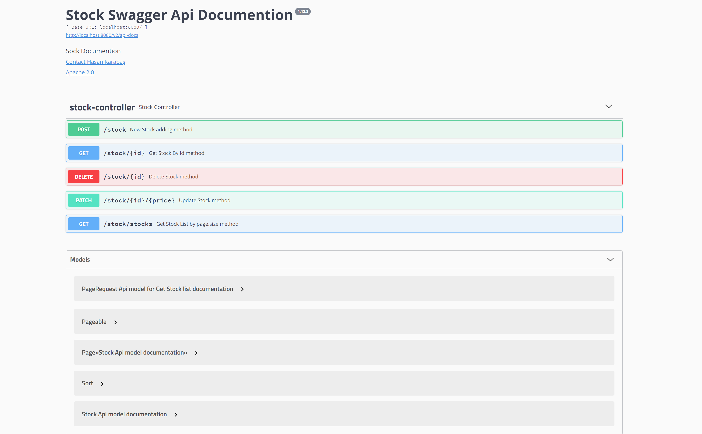

This project for payconiq task of hiring 
Project Structure : 

--Spring Boot 2.5.6

--liquibase for Db migration and initial Data load 

--MySqlDb Relation Db

--Docker deployment,build and Run together with  Docker Compose 

--Swagger Api Documention.

Run with Docker:
docker-compose-stock up --force-recreate

Run with IntelliJ
You Have to set active profile = 'test'

Swagger link : http://localhost:8080/swagger-ui.html#

Swagger Secreen:

